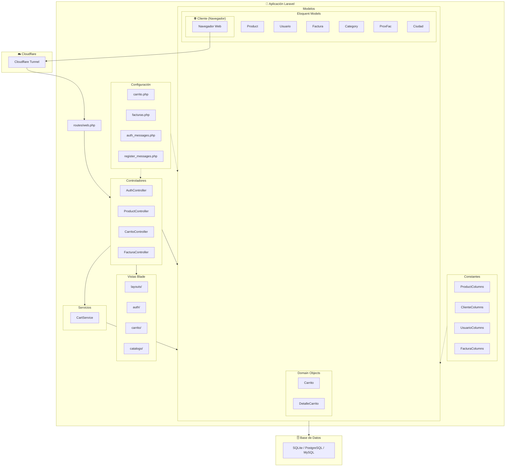
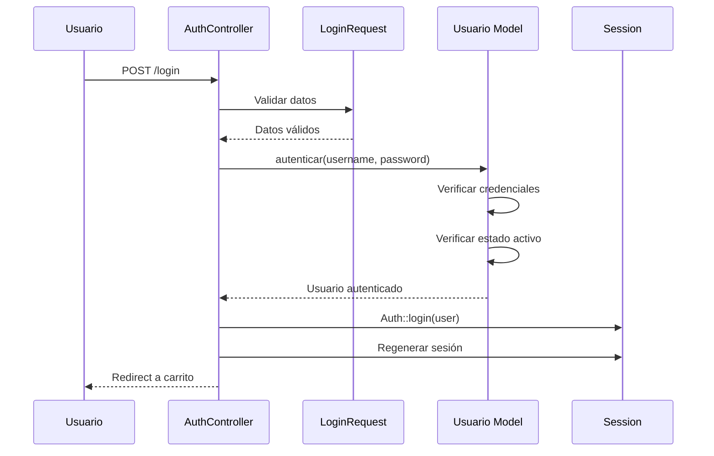
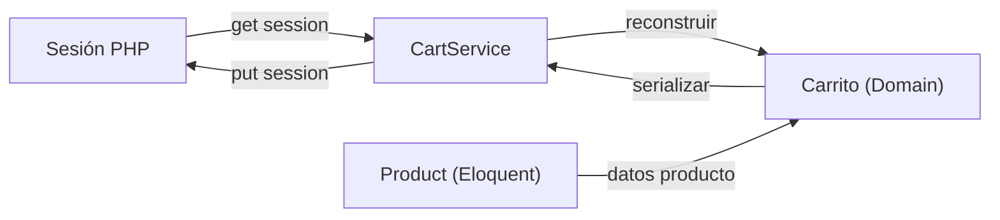
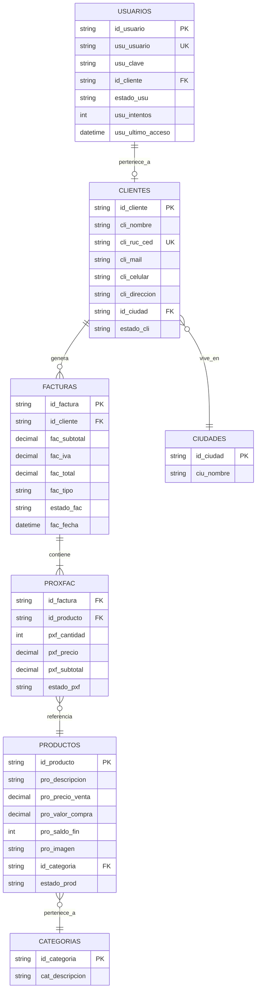
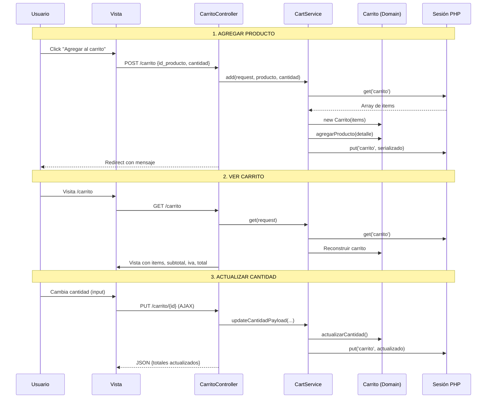
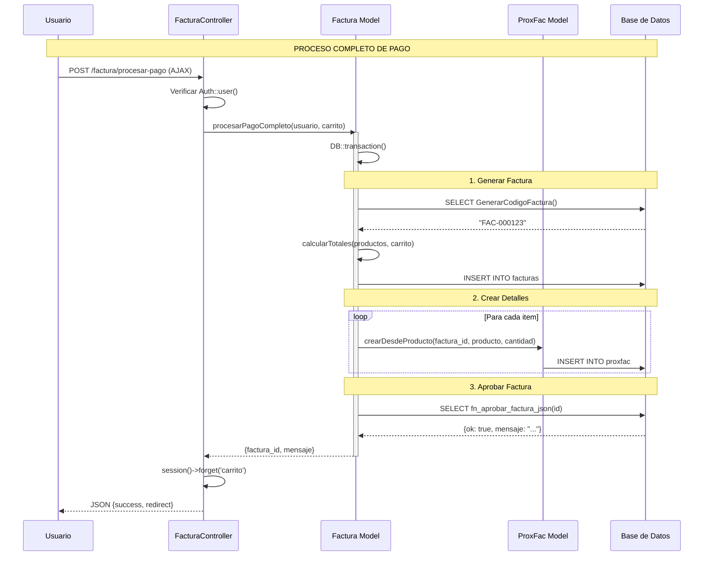
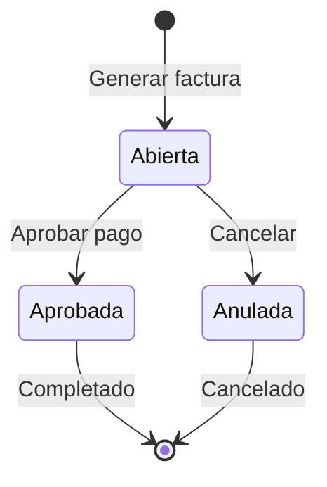
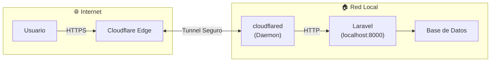
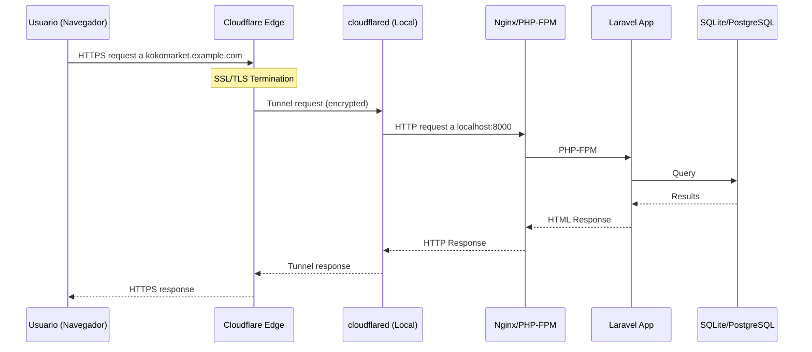

# KoKo Market - Documentación del Sistema

---

## 📋 Tabla de Contenidos

1. [Resumen General](#resumen-general)
2. [Arquitectura del Sistema](#arquitectura-del-sistema)
3. [Estructura de Directorios](#estructura-de-directorios)
4. [Patrón MVC en Detalle](#patrón-mvc-en-detalle)
5. [Modelos (Model Layer)](#modelos-model-layer)
6. [Controladores (Controller Layer)](#controladores-controller-layer)
7. [Vistas (View Layer)](#vistas-view-layer)
8. [Capa de Servicios](#capa-de-servicios)
9. [Sistema de Rutas](#sistema-de-rutas)
10. [Validación de Datos](#validación-de-datos)
11. [Sistema de Configuración](#sistema-de-configuración)
12. [Constantes de Columnas](#constantes-de-columnas)
13. [Base de Datos](#base-de-datos)
14. [Autenticación y Seguridad](#autenticación-y-seguridad)
15. [Flujo de Carrito de Compras](#flujo-de-carrito-de-compras)
16. [Flujo de Facturación](#flujo-de-facturación)
17. [Despliegue con Cloudflare Tunnel](#despliegue-con-cloudflare-tunnel)
18. [Dependencias y Tecnologías](#dependencias-y-tecnologías)

---

## Resumen General

**KoKo Market** es un sistema de e-commerce desarrollado en **Laravel** (framework PHP) que permite a los usuarios:

- Navegar un catálogo de productos
- Agregar productos a un carrito de compras
- Registrarse e iniciar sesión
- Generar facturas y procesar pagos
- Consultar historial de compras

El sistema está diseñado siguiendo el patrón **MVC (Model-View-Controller)** con extensiones como **Domain Objects**, **Services** y **Form Requests** para mantener una arquitectura limpia y escalable.

---

## Arquitectura del Sistema



### Flujo de una Solicitud HTTP

1. **Usuario** realiza una solicitud desde el navegador
2. **Cloudflare Tunnel** reenvía la solicitud al servidor local
3. **Routes** (`web.php`) dirige la solicitud al **Controlador** apropiado
4. **Controlador** coordina la lógica, puede usar **Servicios** y **Modelos**
5. **Modelos** interactúan con la **Base de Datos** (Eloquent ORM)
6. **Controlador** retorna una **Vista** Blade renderizada
7. La respuesta viaja de regreso al usuario

---

## Estructura de Directorios

```
/var/www/kokomarket/
├── app/
│   ├── Constants/              # Constantes de nombres de columnas
│   │   ├── CategoryColumns.php
│   │   ├── ClienteColumns.php
│   │   ├── FacturaColumns.php
│   │   ├── ProductColumns.php
│   │   ├── ProxFacColumns.php
│   │   └── UsuarioColumns.php
│   │
│   ├── Http/
│   │   ├── Controllers/        # Controladores MVC
│   │   │   ├── AuthController.php
│   │   │   ├── CarritoController.php
│   │   │   ├── ClienteLookupController.php
│   │   │   ├── FacturaController.php
│   │   │   ├── HomeController.php
│   │   │   ├── ProductController.php
│   │   │   └── UploadController.php
│   │   │
│   │   └── Requests/           # Validación de formularios
│   │       └── Auth/
│   │           ├── LoginRequest.php
│   │           └── RegisterRequest.php
│   │
│   ├── Models/                 # Modelos Eloquent y Domain Objects
│   │   ├── Carrito.php         # Domain Object (no persiste)
│   │   ├── Category.php        # Eloquent Model
│   │   ├── Ciudad.php          # Eloquent Model
│   │   ├── Cliente.php         # Eloquent Model
│   │   ├── DetalleCarrito.php  # Domain Object (no persiste)
│   │   ├── Factura.php         # Eloquent Model
│   │   ├── Product.php         # Eloquent Model
│   │   ├── ProxFac.php         # Eloquent Model (detalle factura)
│   │   └── Usuario.php         # Eloquent Model (autenticable)
│   │
│   ├── Providers/              # Service Providers de Laravel
│   │
│   └── Services/               # Capa de servicios
│       └── CartService.php     # Lógica del carrito de compras
│
├── config/                     # Archivos de configuración
│   ├── app.php
│   ├── auth.php
│   ├── auth_messages.php       # Mensajes de autenticación
│   ├── carrito.php             # Configuración del carrito
│   ├── database.php
│   ├── facturas.php            # Configuración de facturación
│   ├── register_messages.php   # Mensajes de registro
│   └── ...
│
├── database/
│   └── seeders/                # Seeders de datos (si aplica)
│
├── public/                     # Archivos públicos (punto de entrada)
│   ├── index.php
│   └── assets/
│       ├── css/
│       └── img/
│
├── resources/
│   ├── css/
│   ├── js/
│   └── views/                  # Vistas Blade
│       ├── auth/
│       │   ├── login.blade.php
│       │   └── register.blade.php
│       ├── carrito/
│       ├── catalogo/
│       ├── consultas/
│       ├── home/
│       ├── layouts/
│       │   ├── app.blade.php
│       │   ├── header.blade.php
│       │   └── footer.blade.php
│       └── productos/
│
├── routes/
│   ├── web.php                 # Rutas principales
│   ├── api.php                 # Rutas API (si aplica)
│   └── console.php
│
├── storage/                    # Almacenamiento (logs, cache, uploads)
├── tests/                      # Tests automatizados
├── vendor/                     # Dependencias Composer
├── .env                        # Variables de entorno
├── composer.json
└── vite.config.js
```

---

## Patrón MVC en Detalle

El sistema implementa el patrón **Model-View-Controller** con las siguientes extensiones:

### Modelo (Model)

Los modelos se dividen en dos categorías:

#### 1. Modelos Eloquent (Persistentes)
Representan tablas de la base de datos y usan el ORM de Laravel.

| Modelo | Tabla | Descripción |
|--------|-------|-------------|
| `Product` | `productos` | Productos del catálogo |
| `Usuario` | `usuarios` | Usuarios del sistema (autenticable) |
| `Cliente` | `clientes` | Datos de clientes para facturación |
| `Factura` | `facturas` | Facturas generadas |
| `ProxFac` | `proxfac` | Detalle de items por factura |
| `Category` | `categorias` | Categorías de productos |
| `Ciudad` | `ciudades` | Ciudades para direcciones |

#### 2. Domain Objects (No Persistentes)
Objetos que representan conceptos de dominio pero no se guardan directamente en BD.

| Clase | Descripción |
|-------|-------------|
| `Carrito` | Representa el carrito de compras en memoria |
| `DetalleCarrito` | Representa un ítem dentro del carrito |

### Vista (View)

Las vistas usan el motor de plantillas **Blade** de Laravel:

- **Layouts**: Plantillas base (`app.blade.php`, `header.blade.php`, `footer.blade.php`)
- **Componentes**: Vistas parciales reutilizables
- **Páginas**: Vistas específicas organizadas por funcionalidad

### Controlador (Controller)

Los controladores son **delgados** (thin controllers) y delegan la lógica a:
- **Modelos** con métodos estáticos ("fat models")
- **Servicios** para lógica compleja

---

## Modelos (Model Layer)

### Product (Producto)

**Archivo**: `app/Models/Product.php`  
**Tabla**: `productos`

```php
// Configuración básica
protected $table = 'productos';
protected $primaryKey = 'id_producto';
public $incrementing = false;  // ID no autoincremental
protected $keyType = 'string';
public $timestamps = false;    // Sin created_at/updated_at
```

#### Atributos Principales
| Columna | Descripción |
|---------|-------------|
| `id_producto` | Identificador único (string) |
| `pro_descripcion` | Nombre/descripción del producto |
| `pro_precio_venta` | Precio de venta |
| `pro_valor_compra` | Costo de adquisición |
| `pro_saldo_fin` | Stock disponible (calculado) |
| `pro_imagen` | URL o path de imagen |
| `id_categoria` | FK a categorías |
| `estado_prod` | Estado (ACT=Activo) |

#### Accessors (Getters Virtuales)
```php
public function getPrecioAttribute(): float;           // $producto->precio
public function getStockAttribute(): int;              // $producto->stock
public function getTokenAttribute(): string;           // $producto->token (encriptado)
public function getImageUrlAttribute(): string;        // $producto->image_url
public function getCategoriaNombreAttribute(): string; // $producto->categoria_nombre
```

#### Scopes de Query
```php
Product::activos();                    // Solo productos activos
Product::buscar($q);                   // Búsqueda por descripción
Product::filtrarCategoria($catId);     // Filtrar por categoría
Product::ordenar($sort);               // Ordenar resultados
Product::publico();                    // Con categoría, solo activos
```

#### Métodos Estáticos
```php
Product::catalogo($filters);           // Listado paginado con filtros
Product::masVendidos($limit);          // Top productos vendidos
Product::findByTokenOrFail($token);    // Buscar por token encriptado
Product::relacionados($producto, 4);   // Productos de misma categoría
```

---

### Usuario

**Archivo**: `app/Models/Usuario.php`  
**Tabla**: `usuarios`

Extiende de `Authenticatable` para integración con el sistema de auth de Laravel.

#### Métodos de Autenticación
```php
// Autenticar usuario por credenciales
public static function autenticar(string $username, string $password): self;

// Registrar usuario con su cliente asociado
public static function registrarConCliente(
    array $clienteData,
    array $usuarioData,
    ?string $clienteIdExistente = null
): self;
```

#### Relaciones
```php
public function cliente();  // belongsTo(Cliente::class)
```

#### Sistema de Intentos Fallidos
El modelo implementa bloqueo automático después de 5 intentos fallidos:
```php
private function registrarIntentoFallido(): void;
private function registrarLoginExitoso(): void;
```

---

### Cliente

**Archivo**: `app/Models/Cliente.php`  
**Tabla**: `clientes`

#### Métodos de Negocio
```php
public function tieneUsuario(): bool;           // ¿Tiene usuario asociado?
public function estaActivo(): bool;             // ¿Estado = ACT?
public function validarParaRegistro(): void;    // Lanza excepción si no válido

public static function buscarPorRucCed(string $ruc): ?self;
public static function escenarioRegistro(string $ruc): array;  // Para lookup AJAX
public static function obtenerORegistrarPorIdentificacion(array $data): self;
```

---

### Factura

**Archivo**: `app/Models/Factura.php`  
**Tabla**: `facturas`

#### Flujo de Generación
```php
// 1. Generar factura desde el carrito de sesión
public static function generarDesdeCarrito($usuario, array $carrito): self;

// 2. Aprobar factura (ejecuta función de BD)
public static function aprobarPorFuncion(string $idFactura): string;

// 3. Proceso completo (generar + aprobar atómicamente)
public static function procesarPagoCompleto($usuario, array $carritoSession): array;
```

#### Estados de Factura
| Estado | Código | Descripción |
|--------|--------|-------------|
| Abierta | `ABI` | Recién creada, pendiente de pago |
| Aprobada | `APR` | Pago confirmado |
| Anulada | `ANU` | Cancelada |

---

### Carrito (Domain Object)

**Archivo**: `app/Models/Carrito.php`

> ⚠️ **Importante**: Este modelo NO es un Eloquent Model. Es un **Domain Object** que representa el carrito en memoria.

```php
class Carrito
{
    protected Collection $items;  // Colección de DetalleCarrito
    protected float $iva;         // Tasa de IVA (ej: 0.15)

    public function agregarProducto(DetalleCarrito $detalle): void;
    public function eliminarProducto(string $idProducto): void;
    public function vaciarCarrito(): void;
    
    public function subtotal(): float;
    public function impuestos(): float;
    public function total(): float;
    public function totalArticulos(): int;
}
```

### DetalleCarrito (Domain Object)

**Archivo**: `app/Models/DetalleCarrito.php`

Representa un ítem individual dentro del carrito:

```php
class DetalleCarrito
{
    public string $id_producto;
    public int $cantidad;
    public float $precio_unitario;
    public int $stock;
    public ?string $descripcion;
    public ?string $imagen;

    public function subtotal(): float;
    public function incrementarCantidad(?int $cantidad = null): void;
    public function actualizarCantidad(int $cantidad): void;
}
```

---

## Controladores (Controller Layer)

### AuthController

**Archivo**: `app/Http/Controllers/AuthController.php`

Maneja autenticación y registro de usuarios.

| Método | Ruta | Descripción |
|--------|------|-------------|
| `showLogin()` | GET `/login` | Muestra formulario de login |
| `login()` | POST `/login` | Procesa autenticación |
| `logout()` | POST `/logout` | Cierra sesión |
| `showRegister()` | GET `/register` | Muestra formulario de registro |
| `register()` | POST `/register` | Procesa registro de usuario |

#### Flujo de Login


---

### ProductController

**Archivo**: `app/Http/Controllers/ProductController.php`

Maneja el catálogo de productos.

| Método | Ruta | Descripción |
|--------|------|-------------|
| `catalogo()` | GET `/catalogo` | Listado paginado con filtros |
| `show()` | GET `/productos/{token}` | Detalle de producto |

#### Parámetros de Catálogo
```php
$filters = $request->only(['q', 'cat', 'sort']);

// q: Búsqueda por texto
// cat: ID de categoría
// sort: relevance, price-asc, price-desc, name-asc, name-desc
```

---

### CarritoController

**Archivo**: `app/Http/Controllers/CarritoController.php`

Maneja el carrito de compras. Usa **inyección de dependencias** con `CartService`.

```php
public function __construct(private CartService $cart) {}
```

| Método | Ruta | Descripción |
|--------|------|-------------|
| `index()` | GET `/carrito` | Ver carrito actual |
| `store()` | POST `/carrito` | Agregar producto |
| `update()` | PUT `/carrito/{id}` | Actualizar cantidad |
| `destroy()` | DELETE `/carrito/{id}` | Eliminar producto |
| `clear()` | DELETE `/carrito/vaciar` | Vaciar carrito |

---

### FacturaController

**Archivo**: `app/Http/Controllers/FacturaController.php`

Maneja la generación y gestión de facturas.

| Método | Ruta | Descripción |
|--------|------|-------------|
| `generarFactura()` | POST `/factura/generar` | Crear factura desde carrito |
| `confirmar()` | GET `/factura/{id}/confirmar` | Pantalla de confirmación |
| `aprobar()` | POST `/factura/{id}/aprobar` | Aprobar factura |
| `show()` | GET `/factura/{id}` | Ver factura |
| `listarFacturas()` | GET `/historial-compras` | Historial del usuario |
| `procesarPago()` | POST `/factura/procesar-pago` | Pago AJAX completo |
| `cancelar()` | POST `/facturas/{factura}/cancelar` | Anular factura |

---

## Vistas (View Layer)

### Layout Principal

**Archivo**: `resources/views/layouts/app.blade.php`

```html
<!doctype html>
<html lang="es-EC">
<head>
    <meta charset="utf-8">
    <meta name="viewport" content="width=device-width, initial-scale=1">
    <meta name="csrf-token" content="{{ csrf_token() }}">
    
    <title>@yield('title', 'KoKo Market')</title>
    
    <!-- Bootstrap 5.3.3 -->
    <link href="cdn.jsdelivr.net/npm/bootstrap@5.3.3/..." rel="stylesheet">
    <!-- Bootstrap Icons -->
    <link href="cdn.jsdelivr.net/npm/bootstrap-icons@1.11.3/..." rel="stylesheet">
    <!-- CSS propio -->
    <link rel="stylesheet" href="{{ asset('assets/css/styles.css') }}">
    
    @stack('styles')
</head>
<body class="d-flex flex-column min-vh-100">

    @include('layouts.header')
    
    <main class="flex-fill">
        @yield('content')
    </main>
    
    @include('layouts.footer')
    
    <!-- Scripts -->
    <script src="cdn.jsdelivr.net/npm/bootstrap@5.3.3/..."></script>
    <script src="code.jquery.com/jquery-3.7.1.min.js"></script>
    
    @stack('scripts')
</body>
</html>
```

### Uso en Vistas Hijas

```blade
@extends('layouts.app')

@section('title', 'Mi Página - KoKo Market')

@section('content')
    <div class="container">
        {{-- Contenido aquí --}}
    </div>
@endsection

@push('scripts')
    <script>
        // JavaScript específico de esta página
    </script>
@endpush
```

---

## Capa de Servicios

### CartService

**Archivo**: `app/Services/CartService.php`

Encapsula toda la lógica del carrito de compras, separándola del controlador.

#### Responsabilidades
1. **Obtener carrito** desde la sesión
2. **Persistir carrito** en la sesión
3. **Agregar/eliminar/actualizar** productos
4. **Validar stock** disponible

#### Métodos Principales
```php
public function get(Request $request): Carrito;
public function put(Request $request, Carrito $carrito): void;
public function add(Request $request, Product $producto, int $cantidad): ?string;
public function updateCantidad(Request $request, Product $producto, int $cantidad): ?string;
public function remove(Request $request, string $idProducto): void;
public function clear(Request $request): bool;
```

#### Diagrama del Flujo


---

## Sistema de Rutas

**Archivo**: `routes/web.php`

### Rutas Públicas

```php
// Página principal
Route::get('/', [HomeController::class, 'index'])->name('home');

// Catálogo de productos
Route::get('/catalogo', [ProductController::class, 'catalogo'])
    ->name('catalogo.index');

// Detalle de producto (token encriptado)
Route::get('/productos/{token}', [ProductController::class, 'show'])
    ->where('token', '.*')
    ->name('productos.show');
```

### Grupo de Rutas: Carrito

```php
Route::prefix('carrito')->name('carrito.')->group(function () {
    Route::get('/', [CarritoController::class, 'index'])->name('index');
    Route::post('/', [CarritoController::class, 'store'])->name('store');
    Route::delete('/vaciar', [CarritoController::class, 'clear'])->name('clear');
    Route::put('/{idProducto}', [CarritoController::class, 'update'])->name('update');
    Route::delete('/{idProducto}', [CarritoController::class, 'destroy'])->name('destroy');
});
```

### Rutas de Autenticación

```php
// Login
Route::get('/login', [AuthController::class, 'showLogin'])->name('login');
Route::post('/login', [AuthController::class, 'login'])->name('login.post');

// Logout
Route::post('/logout', [AuthController::class, 'logout'])->name('logout');

// Registro
Route::get('/register', [AuthController::class, 'showRegister'])->name('register');
Route::post('/register', [AuthController::class, 'register'])->name('register.store');
```

### Rutas de Facturación

```php
Route::post('/factura/generar', [FacturaController::class, 'generarFactura'])
    ->name('factura.generar');

Route::get('/factura/{id}/confirmar', [FacturaController::class, 'confirmar'])
    ->name('factura.confirmar');

Route::post('/factura/{id}/aprobar', [FacturaController::class, 'aprobar'])
    ->name('factura.aprobar');

Route::get('/historial-compras', [FacturaController::class, 'listarFacturas'])
    ->name('facturas.historial');

Route::post('/factura/procesar-pago', [FacturaController::class, 'procesarPago'])
    ->name('factura.procesar');
```

---

## Validación de Datos

### Form Requests

Laravel permite crear clases de validación separadas del controlador.

#### LoginRequest

**Archivo**: `app/Http/Requests/Auth/LoginRequest.php`

Valida credenciales de login:
- `usu_usuario`: requerido
- `usu_clave`: requerido

#### RegisterRequest

**Archivo**: `app/Http/Requests/Auth/RegisterRequest.php`

Implementa validación compleja para registro:

```php
public function rules(): array
{
    $esNuevoCliente = !Cliente::where('cli_ruc_ced', $this->input('cli_ruc_ced'))->exists();

    return [
        // CLIENTE
        'cli_nombre'    => ['required', 'string', 'max:40', 'regex:/^[\pL\s\.]+$/u'],
        'cli_ruc_ced'   => ['required', 'string', /* validación custom cedula/RUC */],
        'cli_mail'      => [$esNuevoCliente ? 'required' : 'nullable', 'email', 'max:60'],
        'cli_celular'   => [$esNuevoCliente ? 'required' : 'nullable', 'string', 'max:10'],
        'cli_direccion' => [$esNuevoCliente ? 'required' : 'nullable', 'string', 'max:60'],
        'id_ciudad'     => [$esNuevoCliente ? 'required' : 'nullable', 'exists:ciudades,id_ciudad'],
        
        // USUARIO
        'usu_usuario'   => 'required|string|max:50|unique:usuarios,usu_usuario',
        'usu_clave'     => 'required|string|min:8|confirmed',
    ];
}
```

##### Validación de Cédula/RUC Ecuador
```php
private function validarRucCedula(string $value, callable $fail): void
{
    // Solo números
    if (!preg_match('/^\d+$/', $value)) {
        $fail('Solo números permitidos');
        return;
    }

    $length = strlen($value);

    // Cédula: 10 dígitos
    if ($length === 10) return;

    // RUC: 13 dígitos terminando en 001
    if ($length === 13 && str_ends_with($value, '001')) return;

    $fail('Formato inválido');
}
```

---

## Sistema de Configuración

El sistema usa archivos de configuración centralizados para evitar "magic strings".

### config/carrito.php

```php
return [
    'session_key' => 'carrito',
    
    'cantidad' => [
        'min' => 1,
    ],
    
    'iva' => 0.15,  // 15% IVA Ecuador
    
    'messages' => [
        'agotado' => 'Este producto se encuentra agotado.',
        'stock_insuficiente' => 'No existe stock suficiente...',
        'agregado' => 'Producto agregado al carrito correctamente.',
        // ...
    ],
];
```

**Uso**:
```php
$iva = config('carrito.iva');  // 0.15
$mensaje = config('carrito.messages.agregado');
```

### config/facturas.php

```php
return [
    'session_carrito' => config('carrito.session_key'),
    'iva' => 0.15,
    
    'tipos' => ['eco' => 'ECO'],
    
    'estados' => [
        'abierta'  => 'ABI',
        'aprobada' => 'APR',
        'anulada'  => 'ANU',
    ],
    
    'db' => [
        'fn_generar_codigo' => 'GenerarCodigoFactura',
        'fn_aprobar' => 'fn_aprobar_factura_json',
    ],
];
```

### config/auth_messages.php

```php
return [
    'validation' => [
        'username_required' => 'Debes ingresar tu usuario.',
        'password_required' => 'Debes ingresar tu contraseña.',
    ],
    
    'errors' => [
        'invalid_credentials' => 'Usuario o contraseña incorrectos.',
        'inactive_user' => 'Tu usuario está bloqueado.',
    ],
    
    'success' => [
        'login' => '¡Bienvenido de nuevo a KoKo Market!',
        'register' => '¡Tu cuenta se creó con éxito!',
    ],
];
```

### config/register_messages.php

Contiene todos los mensajes, placeholders y límites del formulario de registro:

```php
return [
    'errors' => [
        'ruc_vacio' => 'La cédula/RUC es obligatoria.',
        'ruc_formato_cedula' => 'La cédula debe tener exactamente 10 dígitos.',
        // ...
    ],
    
    'placeholders' => [
        'ruc_cedula' => 'Ej: 1712345678 o 1712345678001',
        'nombre' => 'Ej: Juan Pérez o Mi Empresa S.A.',
        // ...
    ],
    
    'maxlength' => [
        'ruc_cedula' => 13,
        'nombre' => 40,
        'email' => 60,
        // ...
    ],
];
```

---

## Constantes de Columnas

El sistema define constantes para nombres de tablas y columnas, evitando "magic strings".

### ProductColumns

**Archivo**: `app/Constants/ProductColumns.php`

```php
final class ProductColumns
{
    // Table / PK
    public const TABLE = 'productos';
    public const PK = 'id_producto';

    // Columns
    public const DESCRIPCION   = 'pro_descripcion';
    public const PRECIO_VENTA  = 'pro_precio_venta';
    public const VALOR_COMPRA  = 'pro_valor_compra';
    public const SALDO_INICIAL = 'pro_saldo_inicial';
    public const QTY_INGRESOS  = 'pro_qty_ingresos';
    public const QTY_EGRESOS   = 'pro_qty_egresos';
    public const SALDO_FINAL   = 'pro_saldo_fin';
    public const ESTADO        = 'estado_prod';
    public const IMAGEN        = 'pro_imagen';
    public const CATEGORIA_ID  = 'id_categoria';

    // Values
    public const ESTADO_ACTIVO = 'ACT';
}
```

### Uso en Modelos

```php
use App\Constants\ProductColumns as Col;

class Product extends Model
{
    protected $table = Col::TABLE;
    protected $primaryKey = Col::PK;
    
    public function scopeActivos($query)
    {
        return $query->where(Col::ESTADO, Col::ESTADO_ACTIVO);
    }
}
```

### Otras Constantes

| Archivo | Descripción |
|---------|-------------|
| `ClienteColumns.php` | Columnas de tabla `clientes` |
| `UsuarioColumns.php` | Columnas de tabla `usuarios` |
| `FacturaColumns.php` | Columnas de tabla `facturas` |
| `ProxFacColumns.php` | Columnas de tabla `proxfac` |
| `CategoryColumns.php` | Columnas de tabla `categorias` |

---

## Base de Datos

### Configuración

**Archivo**: `config/database.php`

El sistema utiliza **PostgreSQL** como motor de base de datos, conectándose a una base de datos local existente.

```php
'default' => env('DB_CONNECTION', 'pgsql'),

'connections' => [
    'pgsql' => [
        'driver' => 'pgsql',
        'host' => env('DB_HOST', '127.0.0.1'),
        'port' => env('DB_PORT', '5432'),
        'database' => env('DB_DATABASE', 'kokomarket'),
        'username' => env('DB_USERNAME', 'postgres'),
        'password' => env('DB_PASSWORD', ''),
        'charset' => 'utf8',
        'prefix' => '',
        'schema' => 'public',
        'sslmode' => 'prefer',
    ],
];
```

> [!NOTE]
> El sistema se conecta a una base de datos **PostgreSQL local existente**. No se utilizan migraciones de Laravel ya que la estructura de la base de datos se gestiona directamente en PostgreSQL.

### Diagrama Entidad-Relación



### Funciones Almacenadas

El sistema usa funciones de base de datos para operaciones críticas:

| Función PostgreSQL | Descripción |
|---------------------|-------------|
| `GenerarCodigoFactura()` | Función PL/pgSQL que genera código único de factura |
| `fn_aprobar_factura_json(id)` | Función PL/pgSQL que aprueba factura y actualiza inventario |

---

## Autenticación y Seguridad

### Sistema de Autenticación

El sistema usa el auth nativo de Laravel con el modelo `Usuario`:

```php
// config/auth.php
'guards' => [
    'web' => [
        'driver' => 'session',
        'provider' => 'users',
    ],
],

'providers' => [
    'users' => [
        'driver' => 'eloquent',
        'model' => App\Models\Usuario::class,
    ],
],
```

### Encriptación de Contraseñas

Las contraseñas se encriptan con **bcrypt** via `Hash::make()`:

```php
// Al registrar
$usuario->{Col::PASSWORD} = Hash::make($usuarioData[Col::PASSWORD]);

// Al autenticar
if (!Hash::check($password, $user->{Col::PASSWORD})) {
    // Contraseña incorrecta
}
```

### Tokens de Productos

Los IDs de productos se encriptan para URLs públicas:

```php
// Generar token
public function getTokenAttribute(): string
{
    return Crypt::encryptString($this->getKey());
}

// Desencriptar
public static function findByTokenOrFail(string $token): self
{
    $id = Crypt::decryptString($token);
    return static::findOrFail($id);
}
```

### Protección CSRF

Todas las vistas incluyen el token CSRF:

```html
<meta name="csrf-token" content="{{ csrf_token() }}">

<form method="POST">
    @csrf
    <!-- campos -->
</form>
```

---

## Flujo de Carrito de Compras



### Estructura del Carrito en Sesión

```php
// session('carrito')
[
    'PRO001' => [
        'id_producto' => 'PRO001',
        'cantidad' => 2,
    ],
    'PRO002' => [
        'id_producto' => 'PRO002',
        'cantidad' => 1,
    ],
]
```

---

## Flujo de Facturación



### Estados de Transición de Factura



---

## Despliegue con Cloudflare Tunnel

### ¿Qué es Cloudflare Tunnel?

Cloudflare Tunnel permite exponer una aplicación web local (en tu máquina) a Internet de forma segura, sin necesidad de abrir puertos en el router o tener una IP pública.

### Arquitectura de Despliegue



### Configuración del Tunnel

1. **Instalar cloudflared**
   ```bash
   # En Debian/Ubuntu
   curl -L https://github.com/cloudflare/cloudflared/releases/latest/download/cloudflared-linux-amd64 -o cloudflared
   chmod +x cloudflared
   sudo mv cloudflared /usr/local/bin/
   ```

2. **Autenticar con Cloudflare**
   ```bash
   cloudflared tunnel login
   ```

3. **Crear el tunnel**
   ```bash
   cloudflared tunnel create kokomarket
   ```

4. **Configurar el tunnel** (`~/.cloudflared/config.yml`)
   ```yaml
   tunnel: <TUNNEL_ID>
   credentials-file: ~/.cloudflared/<TUNNEL_ID>.json
   
   ingress:
     - hostname: kokomarket.example.com
       service: http://localhost:8000
     - service: http_status:404
   ```

5. **Configurar DNS**
   ```bash
   cloudflared tunnel route dns kokomarket kokomarket.example.com
   ```

6. **Ejecutar el tunnel**
   ```bash
   # Como servicio
   cloudflared service install
   
   # O manualmente
   cloudflared tunnel run kokomarket
   ```

### Variables de Entorno para Producción

```env
# .env
APP_ENV=production
APP_DEBUG=false
APP_URL=https://kokomarket.example.com

# Configurar trusted proxies para Cloudflare
TRUSTED_PROXIES=*
```

### Ejecutar Laravel para el Tunnel

```bash
# Desarrollo (solo localhost)
php artisan serve

# Para el tunnel (accesible desde cualquier interfaz)
php artisan serve --host=0.0.0.0 --port=8000
```

### Diagrama de Flujo Completo



---

## Dependencias y Tecnologías

### Backend (PHP/Laravel)

| Paquete | Versión | Descripción |
|---------|---------|-------------|
| Laravel Framework | ^11.x | Framework principal |
| PHP | ^8.2 | Lenguaje de programación |
| Eloquent ORM | - | ORM para base de datos |
| Blade | - | Motor de plantillas |
| Carbon | - | Manejo de fechas |

### Frontend

| Tecnología | Versión | Descripción |
|------------|---------|-------------|
| Bootstrap | 5.3.3 | Framework CSS |
| Bootstrap Icons | 1.11.3 | Iconos |
| jQuery | 3.7.1 | Librería JavaScript |
| Vite | - | Bundler de assets |

### Base de Datos

| Driver | Uso |
|--------|-----|
| PostgreSQL | Base de datos local (desarrollo y producción) |

### Infraestructura

| Herramienta | Descripción |
|-------------|-------------|
| Cloudflare Tunnel | Exposición segura a Internet |
| Composer | Gestor de dependencias PHP |
| npm | Gestor de dependencias JavaScript |

---

## Comandos Útiles

### Desarrollo

```bash
# Iniciar servidor de desarrollo
php artisan serve

# Compilar assets (desarrollo)
npm run dev

# Limpiar caché
php artisan cache:clear
php artisan config:clear
php artisan view:clear

# Ver rutas definidas
php artisan route:list
```

### Base de Datos

```bash
# Verificar conexión a PostgreSQL
php artisan db:show

# La estructura de la base de datos se gestiona directamente en PostgreSQL
# No se utilizan migraciones de Laravel
```

### Producción

```bash
# Optimizar para producción
php artisan optimize
php artisan config:cache
php artisan route:cache
php artisan view:cache

# Compilar assets para producción
npm run build
```

---

## Conclusión

KoKo Market es un sistema e-commerce completo que implementa:

- ✅ **MVC Extendido** con Services y Domain Objects
- ✅ **Fat Models** con lógica de negocio encapsulada
- ✅ **Thin Controllers** que solo coordinan
- ✅ **Validación robusta** con Form Requests
- ✅ **Configuración centralizada** sin magic strings
- ✅ **Constantes tipadas** para nombres de columnas
- ✅ **Seguridad** con bcrypt, CSRF, y tokens encriptados
- ✅ **Despliegue seguro** via Cloudflare Tunnel

El sistema está diseñado para ser **mantenible**, **escalable** y **seguro**, siguiendo las mejores prácticas de desarrollo en Laravel.

---

*Documentación generada el 26 de enero de 2026*
